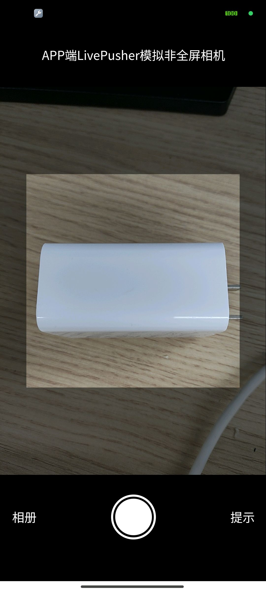

# `LivePusher`模拟相机

`uniapp`官方提供的`uni.createCameraContext()`不支持`APP`端，因此使用`HTML5 Plus API`中的`LivePusher`实现一个

## 截图

## 环境

- `Vue2`
- `Hbuilder X 4.44`

## 其他配置

- `manifest.json`中的【安卓/iOS模块配置】勾选【LivePusher(直播推流)】

